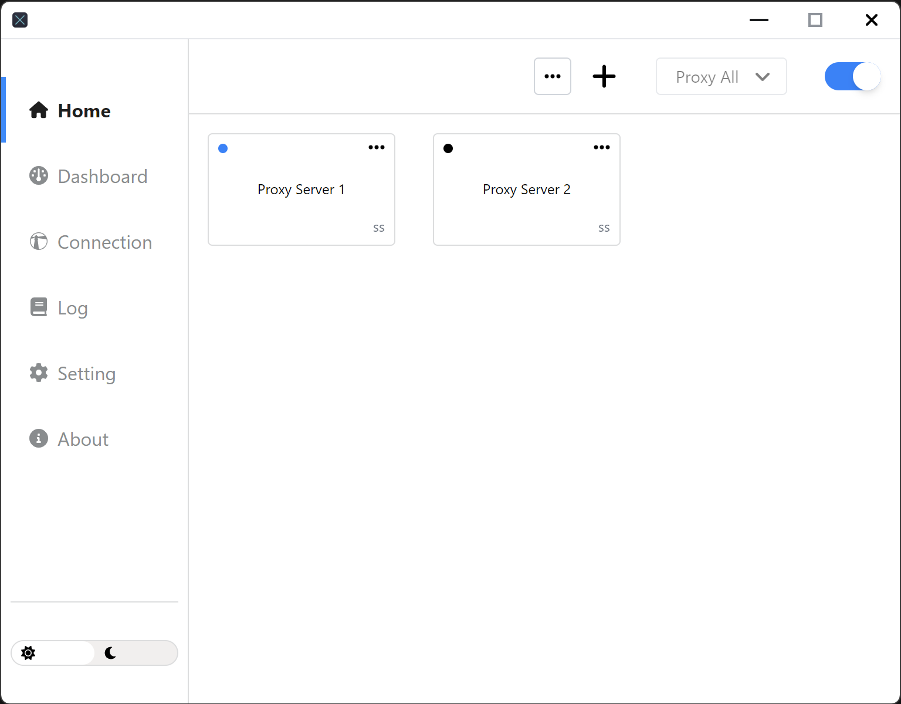

<a name="readme-top"></a>

<br />
<div align="center">
  <a href="https://github.com/igoogolx/lux">
    
  </a>

[![Contributors][contributors-shield]][contributors-url]
[![Forks][forks-shield]][forks-url]
[![Stargazers][stars-shield]][stars-url]
[![Issues][issues-shield]][issues-url]
[![MIT License][license-shield]][license-url]
[![Build Status][build-shield]][build-url]
[![Version][version-shield]][version-url]

<h3 align="center">Lux</h3>
A VPN or proxy client, Wndows only for now, inspired by Outline-client(windows). IPV6: not support. 
  <p align="center">
    <br />
    <a href="https://github.com/igoogolx/lux/wiki"><strong>Explore the docs »</strong></a>
    <br />
    <br />
    <a href="https://igoogolx.github.io/lux-dashboard/">View Demo</a>
    .
    <a href="https://github.com/igoogolx/lux/issues">Report Bug</a>
    ·
    <a href="https://github.com/igoogolx/lux/issues">Request Feature</a>
  </p>
</div>


- [About The Project](#about-the-project)
    - [Features](#features)
- [Getting Started](#getting-started)
    - [1. Install it as an app](#1-install-it-as-an-app)
      - [1.1 Install it manually](#11-install-it-manually)
      - [1.2 Install it from winget(windows only)](#12-install-it-from-wingetwindows-only)
    - [2. Start it from terminal](#2-start-it-from-terminal)
- [Modules](#modules)
- [Development](#development)
  - [Prerequisites](#prerequisites)
  - [Build](#build)
- [Roadmap](#roadmap)
- [Built With](#built-with)
- [License](#license)
- [Contact](#contact)


## About The Project

<div align="center">
<a href="https://github.com/igoogolx/lux">
    
</a>
</div>

There are many great proxy clients available on GitHub like [shadowsocks-windows](https://github.com/shadowsocks/shadowsocks-windows), [clash](https://github.com/Dreamacro/clash). However, I didn't find one that really suited my needs, so I created this one.
This project aims to make a one-click proxy clients, so users don't need to perform complicated configuration.
Note that this project only contains building scripts. See more source code in modules section.


#### Features

- Supports Shadowsocks, Socks5
- Built-in Shadowsocks plugin: simple-obfs, v2ray
- Local Http proxy
- Supports UDP
- Built-in Dns, Dns over TCP

<p align="right">(<a href="#readme-top">back to top</a>)</p>


<!-- GETTING STARTED -->
## Getting Started

There are two ways to use lux.

#### 1. Install it as an app
##### 1.1 Install it manually
1. Download the [installer](https://github.com/igoogolx/lux/releases) file and install it
2. Open it like a normal app

##### 1.2 Install it from [winget](https://github.com/microsoft/winget-cli)(windows only)
`winget install igoogolx.lux`

#### 2. Start it from terminal
1. Download the [portable app](https://github.com/igoogolx/lux/releases) file.
2. Unzip it to your favorite folder
3. Open terminal as **admin** from the folder
4. Run `lux`
5. Copy the url from the output and open it in your browser


## Modules
* [lux-core](https://github.com/igoogolx/lux-core)
* [lux-js-sdk](https://github.com/igoogolx/lux-js-sdk)
* [lux-dashboard](https://github.com/igoogolx/lux-dashboard)
* [lux-geo-data](https://github.com/igoogolx/lux-geo-data)
* [lux-client](https://github.com/igoogolx/lux-client)

## Development

### Prerequisites

1. Install [Node.js](https://nodejs.org/en/)
2. Install [Yarn](https://classic.yarnpkg.com/lang/en/docs/install)

### Build

1. Clone the repo
   ```sh
   git clone https://github.com/igoogolx/lux.git
   ```
2. Install NPM packages
   ```sh
   yarn install
   ```
3. Fetch modules
   ```sh
   yarn init-modules
   ```
   Download necessary modules
4. Start
   ```sh
   yarn build
   ```
   Builds the app for production to the `out` folder.<br />

<p align="right">(<a href="#readme-top">back to top</a>)</p>


## Roadmap

- [x] Add splash screen
- [ ] Improve UI of About page
- [ ] Improve UI Dark mode
- [ ] Support DNS over https
- [ ] Support Mac OS
- [ ] Support IPV6
- [ ] Migrate to tauri

See the [open issues](https://github.com/igoogolx/lux/issues) for a full list of proposed features (and known issues).

<p align="right">(<a href="#readme-top">back to top</a>)</p>


## Built With

* [![React][React.js]][React-url]
* [![Vue][Electron.js]][Electron-url]
* [![Go][Go.dev]][Golang-url]

<p align="right">(<a href="#readme-top">back to top</a>)</p>


<!-- LICENSE -->
## License

Distributed under the MIT License. See `LICENSE.txt` for more information.

<p align="right">(<a href="#readme-top">back to top</a>)</p>


<!-- CONTACT -->
## Contact

Project Link: [https://github.com/igoogolx/lux](https://github.com/igoogolx/lux)

<p align="right">(<a href="#readme-top">back to top</a>)</p>


[contributors-shield]: https://img.shields.io/github/contributors/igoogolx/lux.svg
[contributors-url]: https://github.com/igoogolx/lux/graphs/contributors
[forks-shield]: https://img.shields.io/github/forks/igoogolx/lux.svg
[forks-url]: https://github.com/igoogolx/lux/network/members
[stars-shield]: https://img.shields.io/github/stars/igoogolx/lux.svg
[stars-url]: https://github.com/igoogolx/lux/stargazers
[issues-shield]: https://img.shields.io/github/issues/igoogolx/lux.svg
[issues-url]: https://github.com/igoogolx/lux/issues
[license-shield]: https://img.shields.io/github/license/igoogolx/lux.svg
[license-url]: https://github.com/igoogolx/lux/blob/master/LICENSE.txt
[build-shield]: https://github.com/igoogolx/lux/actions/workflows/build.yml/badge.svg
[build-url]: https://github.com/igoogolx/lux/actions/workflows/build.yml
[version-shield]: https://img.shields.io/github/package-json/v/igoogolx/lux
[version-url]: https://github.com/igoogolx/lux/releases

[React.js]: https://img.shields.io/badge/React-20232A?logo=react&logoColor=61DAFB
[React-url]: https://reactjs.org/
[Electron.js]: https://img.shields.io/badge/Electron-20232A?logo=electron&logoColor=61DAFB
[Electron-url]: https://www.electronjs.org/
[Go.dev]: https://img.shields.io/badge/Go-20232A?logo=go&logoColor=61DAFB
[Golang-url]: https://go.dev/

[product-screenshot]: assets/screenshot.png
